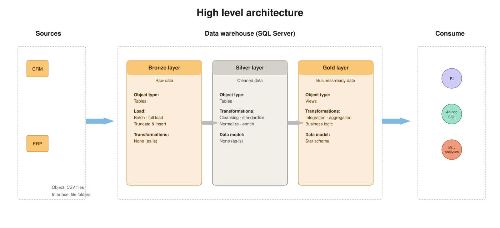
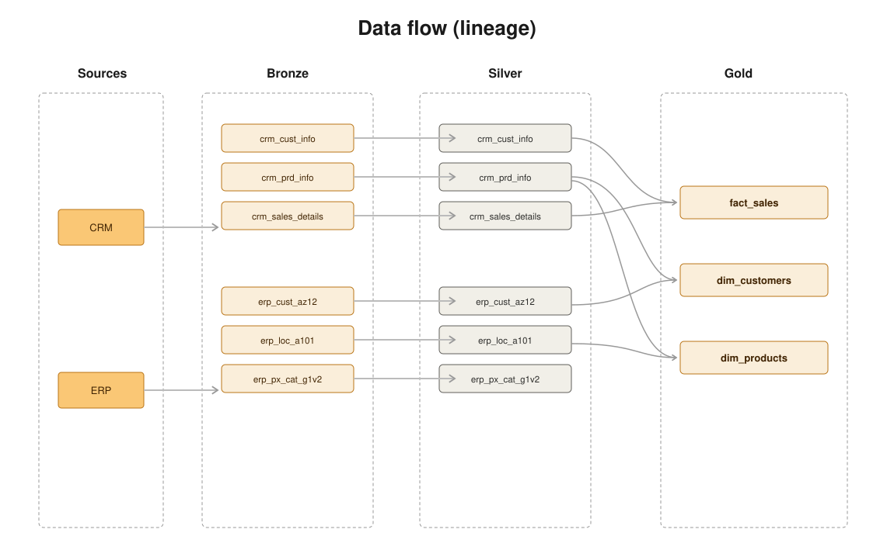
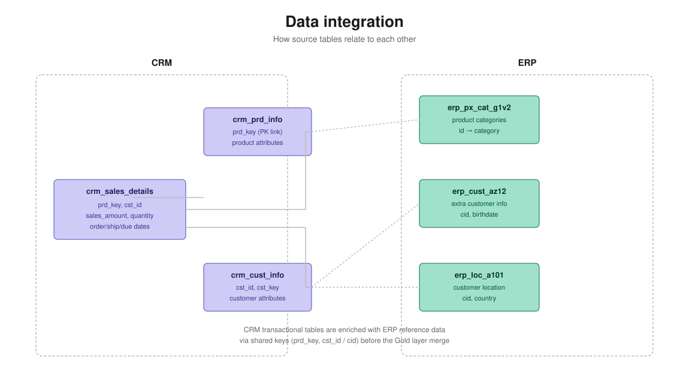
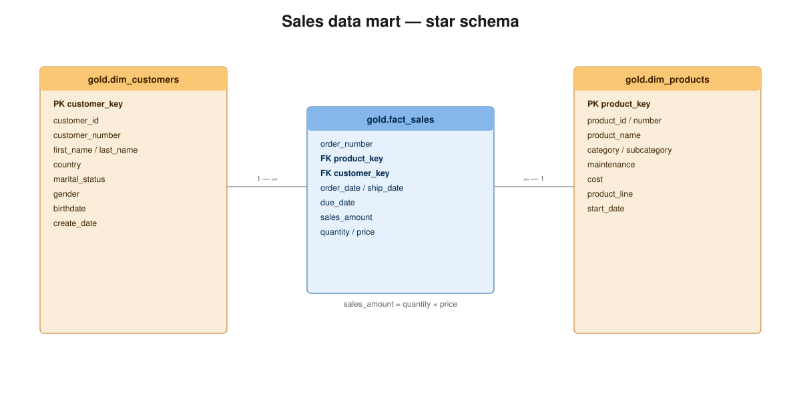
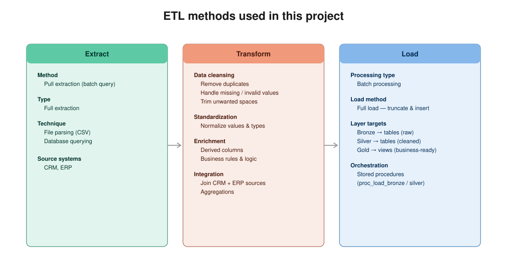

# SQL Data Warehouse Project

A medallion-architecture data warehouse built in SQL Server — Bronze, Silver, and Gold layers, ETL stored procedures, and data quality checks, modeled into a star schema for analytics and reporting.

---

## 👤 About Me

**Snohit Kumar Patro** — Power BI Developer & Microsoft Fabric Engineer with 3+ years of experience at LTIMindtree, Hyderabad.

Microsoft Certified: **PL-300 · DP-600 · DP-700**

[](https://linkedin.com/in/snohit-patro)

---

## 🏗️ Data Architecture

Built on the **Medallion Architecture** — Bronze, Silver, and Gold layers:



1. **Bronze layer** — raw data ingested as-is from CSV source files into SQL Server, no transformations.
2. **Silver layer** — cleansed, standardized, and normalized data ready for integration.
3. **Gold layer** — business-ready views modeled into a star schema for reporting and analytics.

---

## 🔄 Data Flow & Lineage



Tracks how each source table moves from Bronze → Silver → Gold, including which Gold objects each Silver table feeds into.

---

## 🔗 Data Integration



Shows how CRM transactional tables are enriched with ERP reference data via shared keys before the Gold-layer merge.

---

## ⭐ Data Model — Star Schema



`gold.fact_sales` connects to `gold.dim_customers` and `gold.dim_products` via surrogate keys, optimized for analytical queries.

---

## ⚙️ ETL Methods



Pull-based batch extraction → cleansing/standardization/enrichment → full load via stored procedures (truncate & insert).

---

## 🗂️ Project Structure

```
sql-data-warehouse-project/
├── datasets/
│   ├── source_crm/          # cust_info, prd_info, sales_details
│   └── source_erp/          # CUST_AZ12, LOC_A101, PX_CAT_G1V2
├── docs/
│   ├── data_architecture.svg
│   ├── data_flow.svg
│   ├── data_integration.svg
│   ├── data_model.svg
│   ├── etl_methods.svg
│   ├── data_catalog.md
│   └── naming_conventions.md
├── scripts/
│   ├── init_database.sql
│   ├── bronze/   (ddl + proc_load)
│   ├── silver/   (ddl + proc_load)
│   └── gold/     (ddl views)
├── tests/
│   ├── quality_checks_silver.sql
│   └── quality_checks_gold.sql
└── LICENSE
```

---

## 🛠️ Tech Stack

- **SQL Server** (T-SQL)
- **Medallion Architecture** — Bronze / Silver / Gold
- **Star Schema** modeling for the Gold layer

---

## 🚀 How to Run

1. Set up a SQL Server instance (SQL Server Express works fine).
2. Run `scripts/init_database.sql` to create the database and schemas.
3. Run Bronze DDL + stored procedure to ingest raw CSVs.
4. Run Silver DDL + stored procedure to clean and standardize data.
5. Run Gold DDL to create the final star-schema views.
6. Run scripts in `tests/` to validate data quality at each layer.

---

## 📄 License

[MIT License](LICENSE)
